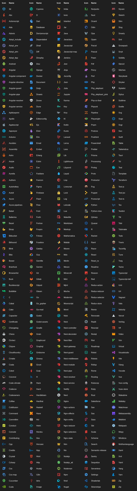
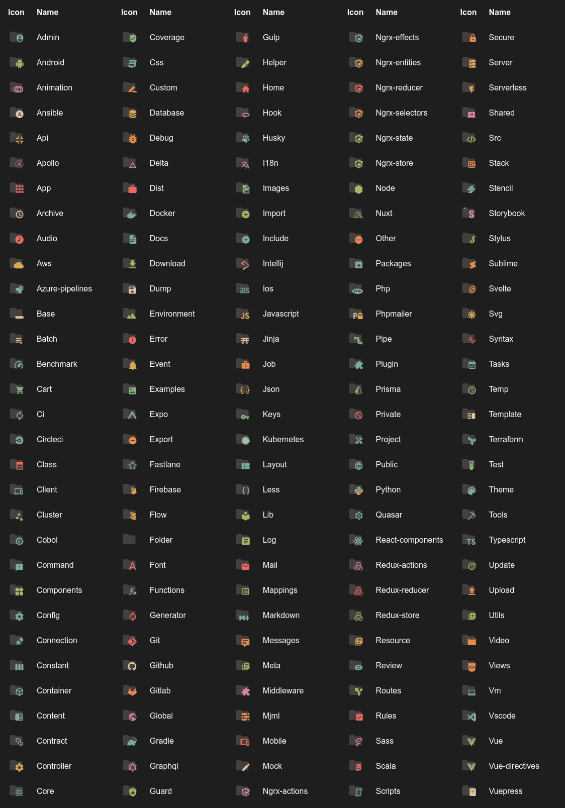

<h1 align="center">
   
    
    
  Icons - Maintained
   
   
</h1>

<h4 align="center">Get the Icons into VS Code, Cursor, VSCodium, Antigravity, and more.</h4>

VS Code Marketplace

    &nbsp;
    &nbsp;
    &nbsp;
    

Open VSX Registry

&nbsp;
&nbsp;

> **Originally created by [Mhammed Talhaouy (@tal7aouy)](https://github.com/tal7aouy)** — [original repository](https://github.com/tal7aouy/vscode-icons).
>
> This extension is now maintained by **[yusifaliyevpro](https://github.com/yusifaliyevpro)**. Contributions and PRs are welcome!

## Contributing

Missing an icon for your favorite language or tool? You can add it yourself! Check out the [Contributing Guide](CONTRIBUTING.md) to learn how to add new file or folder icons and open a PR.

## Installation

### VS Code

1. Open the extensions sidebar (`Ctrl+Shift+X`)
1. Search for **Icons - Maintained**, or install directly from the [VS Code Marketplace](https://marketplace.visualstudio.com/items?itemName=yusifaliyevpro.vscicons)
1. Click Install
1. Select the Manage Cog (bottom left) > File Icon Theme ＞ **Icons**
1. 🌟🌟🌟🌟🌟 Rate five-stars 😃

### Cursor / VSCodium / Antigravity / Gitpod / Other Open VSX editors

1. Open the extensions sidebar
1. Search for **Icons - Maintained**, or install directly from the [Open VSX Registry](https://open-vsx.org/extension/yusifaliyevpro/vscicons)
1. Click Install
1. Select File Icon Theme ＞ **Icons**

## How to use

After installation and activation, you should go in settings (`File` → `Preferences` on Windows, or `Code` → `Preferences` on OSX), choose `File Icon Theme`, and select `Icons`.

## Want more?

I can add more icons if you need, [open a **new** issue](https://github.com/yusifaliyevpro/vscode-icons/issues) to ask which extension you want.

## Changelog

[See full changelog here](https://github.com/yusifaliyevpro/vscode-icons/blob/main/CHANGELOG.md)

## Icon sources

- [Material Design Icons](https://materialdesignicons.com/)
- official icons

## Contributors

This project exists thanks to all the people who contribute.

## File icons

## Folder icons

